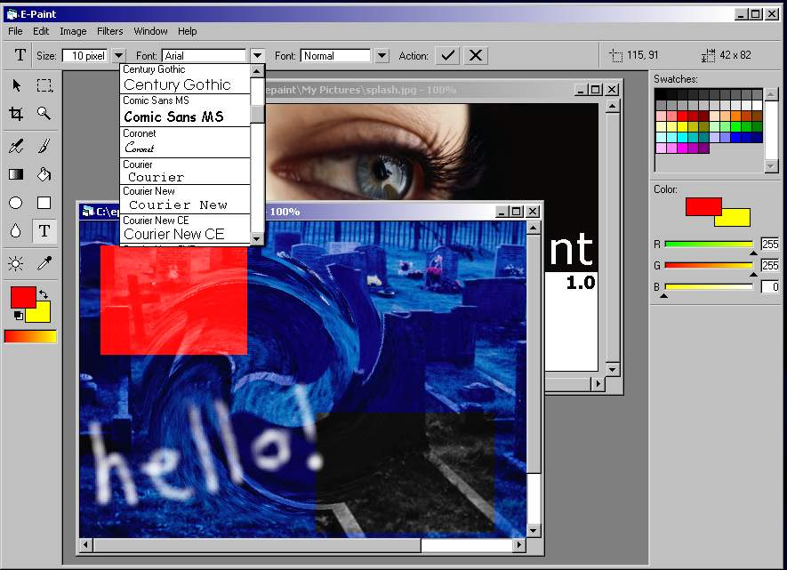



## E Paint

### Description

EPaint is a full photo/image editing program, including a bunch of tools and the possibility of creating your own filters on the fly. Wether you like this code or not, please leave your comment and/or vote. Thank you.
 
### More Info
 
Please note, you need to compile the epaint\filters\twirl.vbp project before running EPaint (if you wish the filter to work).

             |
---                |---
**Submitted On**   |2001-08-13 00:15:28
**By**             |[Thomas Raben](https://github.com/Planet-Source-Code/PSCIndex/blob/master/ByAuthor/thomas-raben.md)
**Level**          |Advanced
**User Rating**    |4.9 (89 globes from 18 users)
**Compatibility**  |VB 4\.0 \(32\-bit\), VB 5\.0, VB 6\.0
**Category**       |[Complete Applications](https://github.com/Planet-Source-Code/PSCIndex/blob/master/ByCategory/complete-applications__1-27.md)
**World**          |[Visual Basic](https://github.com/Planet-Source-Code/PSCIndex/blob/master/ByWorld/visual-basic.md)
**Archive File**   |[EPaint246088142001\.zip](https://github.com/Planet-Source-Code/thomas-raben-e-paint__1-26172/archive/master.zip)

### API Declarations

see the code

